# Лабораторная работа №1

**Выполнил:** Палкина Агата  
**Группа:** ЛР-3  
**Дисциплина:** Процедурное программирование  
**Вариант:** чётные номера заданий

---

## Задание 1. Методы

### Задача 2. Сумма знаков

**Текст задачи.**  
Дана сигнатура метода: `public int sumLastNums(int x);`  
Необходимо реализовать метод таким образом, чтобы он возвращал результат сложения двух последних знаков числа `x`, предполагая, что знаков в числе не менее двух.

**Алгоритм решения:**

1. Получаем последний знак числа через `x % 10`.
2. Получаем предпоследний знак через `(x / 10) % 10`.
3. Складываем оба знака.
4. Возвращаем результат.

**Тестирование:**

Корректный ввод (пример из задания):

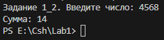

Некорректный ввод:

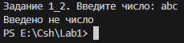

---

### Задача 4. Есть ли позитив

**Текст задачи.**  
Дана сигнатура метода: `public bool isPositive(int x);`  
Метод принимает число `x` и возвращает `true`, если оно положительное.

**Алгоритм решения:**

1. Сравниваем `x` с нулём.
2. Если `x > 0` — `true`.
3. Иначе — `false`.

**Тестирование:**

Корректный ввод (положительное — пример из задания):

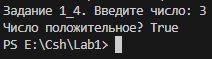

Корректный ввод (отрицательное — пример из задания):

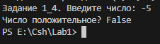

Некорректный ввод:

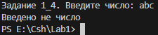

---

### Задача 6. Большая буква

**Текст задачи.**  
Дана сигнатура метода: `public bool isUpperCase(char x);`  
Метод принимает символ `x` и возвращает `true`, если это большая буква в диапазоне `'A'`–`'Z'`.

**Алгоритм решения:**

1. Проверяем, что код символа не меньше `'A'`.
2. Проверяем, что код символа не больше `'Z'`.
3. Если оба условия выполнены — `true`, иначе `false`.

**Тестирование:**

Корректный ввод (большая буква — пример из задания):

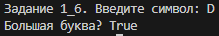

Корректный ввод (маленькая буква — пример из задания):

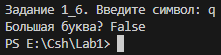

Некорректный ввод:

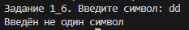

---

### Задача 8. Делитель

**Текст задачи.**  
Дана сигнатура метода: `public bool isDivisor(int a, int b);`  
Метод возвращает `true`, если любое из принятых чисел делит другое нацело.

**Алгоритм решения:**

1. Проверяем `a % b == 0` — тогда `b` делит `a`, возвращаем `true`.
2. Иначе проверяем `b % a == 0` — тогда `a` делит `b`, возвращаем `true`.
3. Иначе — `false`.

**Тестирование:**

Корректный ввод (делится — пример из задания):

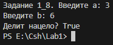

Корректный ввод (не делится — пример из задания):

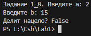

Некорректный ввод:

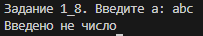

---

### Задача 10. Многократный вызов

**Текст задачи.**  
Дана сигнатура метода: `public int lastNumSum(int a, int b);`  
Метод считает сумму цифр двух чисел из разряда единиц. С его помощью выполняется последовательное сложение пяти чисел, результат выводится на экран.

**Алгоритм решения:**

1. Возвращаем `a % 10 + b % 10`.
2. В сценарии вызываем `lastNumSum` четыре раза подряд:
   - `5 + 11` → передаём в следующий вызов вместе с `123`;
   - результат — с `14`;
   - результат — с `1`.
3. Выводим итоговое значение.

**Тестирование:**

Корректный ввод (пример из задания):

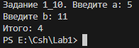

Некорректный ввод:

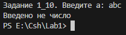

---

## Задание 2. Условия

### Задача 2. Безопасное деление

**Текст задачи.**  
Дана сигнатура метода: `public double safeDiv(int x, int y);`  
Метод возвращает деление `x` на `y` и гарантирует отсутствие ошибки деления на 0. При делении на 0 возвращает 0.

**Алгоритм решения:**

1. Если `y == 0` — возвращаем `0`.
2. Иначе — возвращаем `(double)x / y`.

**Тестирование:**

Корректный ввод (обычное деление — пример из задания):

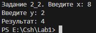

Корректный ввод (деление на 0 — пример из задания):

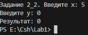

Некорректный ввод:

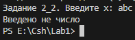

---

### Задача 4. Строка сравнения

**Текст задачи.**  
Дана сигнатура метода: `public string makeDecision(int x, int y);`  
Метод возвращает строку с двумя числами и знаком сравнения.

**Алгоритм решения:**

1. Если `x > y` — знак `>`.
2. Если `x < y` — знак `<`.
3. Иначе — знак `==`.
4. Возвращаем `x<знак>y`.

**Тестирование:**

Корректный ввод (больше — пример из задания):

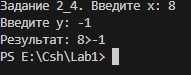

Корректный ввод (равно — пример из задания):

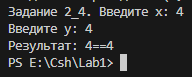

Некорректный ввод:

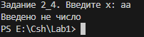

---

### Задача 6. Тройная сумма

**Текст задачи.**  
Дана сигнатура метода: `public bool sum3(int x, int y, int z);`  
Метод возвращает `true`, если два любых числа из трёх можно сложить так, чтобы получить третье.

**Алгоритм решения:**

1. Проверяем `x + y == z`.
2. Проверяем `x + z == y`.
3. Проверяем `y + z == x`.
4. Если хотя бы одно условие выполнено — `true`, иначе `false`.

**Тестирование:**

Корректный ввод (можно — пример из задания):

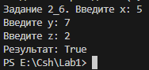

Корректный ввод (нельзя — пример из задания):

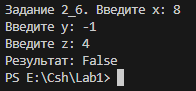

Некорректный ввод:

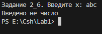

---

### Задача 8. Возраст

**Текст задачи.**  
Дана сигнатура метода: `public string age(int x);`  
Метод возвращает строку с числом и словом `год` / `года` / `лет` по правилам русского языка.

**Алгоритм решения:**

1. Если `x % 100` в диапазоне 11–19 — `лет`.
2. Иначе если `x % 10 == 1` — `год`.
3. Иначе если `x % 10` в 2–4 — `года`.
4. Иначе — `лет`.

**Тестирование:**

Корректный ввод (года — пример из задания):

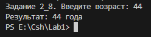

Корректный ввод (год — пример из задания):

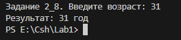

Корректный ввод (исключение — проверка правила 11–14):

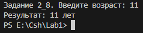

Некорректный ввод:

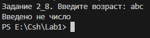

---

### Задача 10. Вывод дней недели

**Текст задачи.**  
Дана сигнатура метода: `public void printDays(string x);`  
Метод выводит название дня недели и всех последующих до конца недели. Если введено не день недели — выводит «Это не день недели».

**Алгоритм решения:**

1. Через `switch` определяем день.
2. Для каждого дня выводим его и все последующие по порядку.
3. Если введено не день недели — выводим сообщение об ошибке.

**Тестирование:**

Корректный ввод (середина недели — пример из задания):

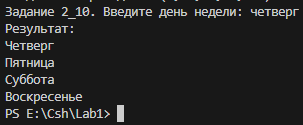

Корректный ввод (начало недели):

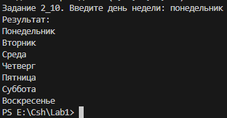

Некорректный ввод:

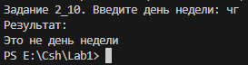

---

## Задание 3. Циклы

### Задача 2. Числа наоборот

**Текст задачи.**  
Дана сигнатура метода: `public string reverseListNums(int x);`  
Метод возвращает строку с числами от `x` до `0` включительно.

**Алгоритм решения:**

1. Идём циклом от `x` вниз до `0`.
2. Добавляем число и пробел к строке.
3. Возвращаем строку.

**Тестирование:**

Корректный ввод (пример из задания):

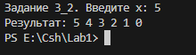

Корректный ввод (граничный — ноль):

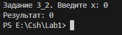

Некорректный ввод:

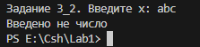

---

### Задача 4. Степень числа

**Текст задачи.**  
Дана сигнатура метода: `public int pow(int x, int y);`  
Метод возвращает `x` в степени `y`.

**Алгоритм решения:**

1. `res = 1`.
2. Пока `i < y` — умножаем `res` на `x`, увеличиваем `i`.
3. Возвращаем `res`.

**Тестирование:**

Корректный ввод (пример из задания):

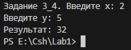

Корректный ввод (граничный — степень 0):

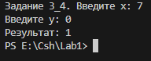

Некорректный ввод:

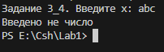

---

### Задача 6. Одинаковость

**Текст задачи.**  
Дана сигнатура метода: `public bool equalNum(int x);`  
Метод возвращает `true`, если все знаки числа одинаковы.

**Алгоритм решения:**

1. Запоминаем последнюю цифру числа.
2. Отбрасываем её делением на 10.
3. В цикле сравниваем новую последнюю цифру с эталоном.
4. Если не совпала — `false`.
5. Если цикл завершён — `true`.

**Тестирование:**

Корректный ввод (одинаковые — пример из задания):

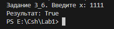

Корректный ввод (разные — пример из задания):

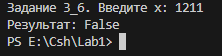

Некорректный ввод:

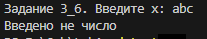

---

### Задача 8. Левый треугольник

**Текст задачи.**  
Дана сигнатура метода: `public void leftTriangle(int x);`  
Метод выводит треугольник из символов `*` высотой `x`, количество символов в строке совпадает с номером строки.

**Алгоритм решения:**

1. Заводим пустую строку.
2. В цикле от 0 до `x - 1`:
   - добавляем `*`;
   - выводим строку.

**Тестирование:**

Корректный ввод (пример из задания):

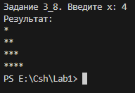

Корректный ввод (минимальный):

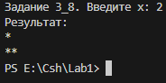

Некорректный ввод:

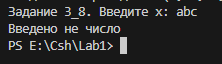

---

### Задача 10. Угадайка

**Текст задачи.**  
Дана сигнатура метода: `public void guessGame();`  
Метод генерирует случайное число 0–9, считывает ввод, повторяет до угадывания. Выводит количество попыток.

**Алгоритм решения:**

1. Генерируем случайное число `num` от 0 до 9.
2. В цикле `do..while`:
   - запрашиваем число;
   - если не число — `continue`, попытка не считается;
   - увеличиваем счётчик;
   - сравниваем с `num`;
   - если угадал — выходим.
3. Выводим число попыток с правильным склонением.

**Тестирование:**

Корректный ввод (угадал сразу):

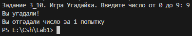

Корректный ввод (угадал не сразу):

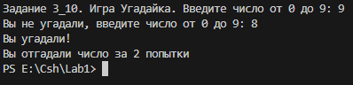

Некорректный ввод:

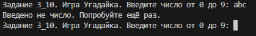

---

## Задание 4. Массивы

### Задача 2. Поиск последнего значения

**Текст задачи.**  
Дана сигнатура метода: `public int findLast(int[] arr, int x);`  
Метод возвращает индекс последнего вхождения числа `x` в массив `arr`. Если числа нет — `-1`.

**Алгоритм решения:**

1. Идём по массиву от конца к началу.
2. Как только встретили `x` — возвращаем индекс.
3. Если прошли весь массив — возвращаем `-1`.

**Тестирование:**

Корректный ввод (пример из задания):

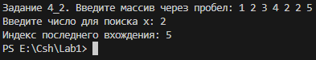

Корректный ввод (числа нет):

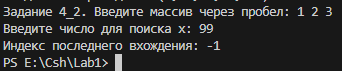

Некорректный ввод:

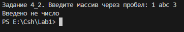

---

### Задача 4. Добавление в массив

**Текст задачи.**  
Дана сигнатура метода: `public int[] add(int[] arr, int x, int pos);`  
Метод возвращает новый массив с вставленным в позицию `pos` значением `x`.

**Алгоритм решения:**

1. Создаём массив длины `arr.Length + 1`.
2. Идём по новому массиву:
   - `i < pos` — копируем `arr[i]`;
   - `i == pos` — кладём `x`;
   - `i > pos` — копируем `arr[i - 1]`.

**Тестирование:**

Корректный ввод (пример из задания):

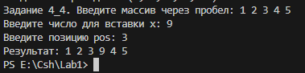

Корректный ввод (граничный — вставка в начало):

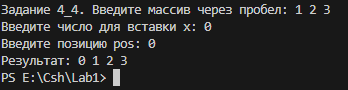

Некорректный ввод:

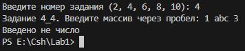

---

### Задача 6. Реверс

**Текст задачи.**  
Дана сигнатура метода: `public void reverse(int[] arr);`  
Метод изменяет массив так, чтобы элементы шли в обратном порядке.

**Алгоритм решения:**

1. Ставим указатели `i = 0`, `j = arr.Length - 1`.
2. Пока `i < j` — меняем местами `arr[i]` и `arr[j]`, сдвигаем указатели.

**Тестирование:**

Корректный ввод (пример из задания):

Корректный ввод (чётная длина):

Некорректный ввод:

---

### Задача 8. Объединение

**Текст задачи.**  
Дана сигнатура метода: `public int[] concat(int[] arr1, int[] arr2);`  
Метод возвращает новый массив: сначала элементы `arr1`, затем `arr2`.

**Алгоритм решения:**

1. Создаём массив длины `arr1.Length + arr2.Length`.
2. Копируем `arr1` в начало.
3. Копируем `arr2` в конец со сдвигом на `arr1.Length`.

**Тестирование:**

Корректный ввод (пример из задания):

Корректный ввод (первый массив пуст):

Некорректный ввод:

---

### Задача 10. Удалить негатив

**Текст задачи.**  
Дана сигнатура метода: `public int[] deleteNegative(int[] arr);`  
Метод возвращает новый массив со всеми элементами `arr`, кроме отрицательных.

**Алгоритм решения:**

1. Первый проход — считаем неотрицательные.
2. Создаём массив нужной длины.
3. Второй проход — копируем неотрицательные через отдельный счётчик.

**Тестирование:**

Корректный ввод (пример из задания):

Корректный ввод (все отрицательные):

Некорректный ввод:

---

## Примечания

- Все методы реализованы в одном классе `Tasks`.
- Сценарии ввода-вывода вынесены в класс `Program` с модификатором `private`.
- В `Main` — меню выбора задания и вызов сценария.
- Для всех задач реализована проверка ввода через `TryParse`.
